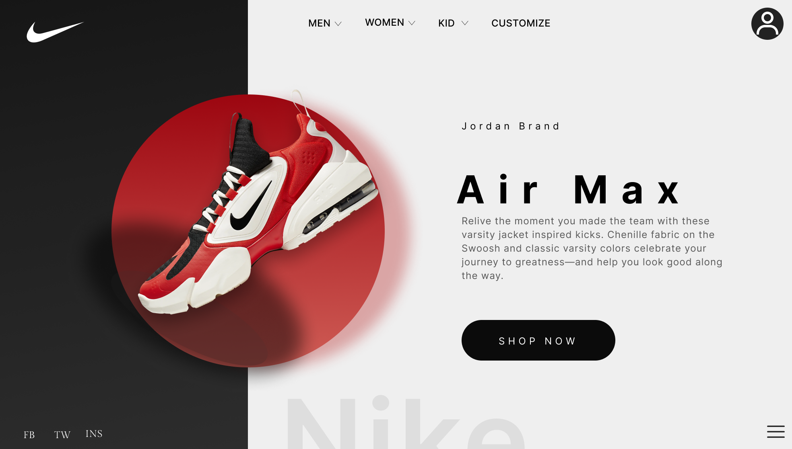

# **LANDINGPAGE NIKE**

## [Clique aqui](https://viniciusnunes137.github.io/landing-page-nike/) para acessar o site

## **SOBRE**

- Site tipo do landing page com a finalidade de divulgação do tênis da NIKE Air Max.
- - Foi proposto esse projeto pelo professor de Linguagem de Marcação com a finalidade de replicar um projeto já desenvolvido no FIGMA com a finalidade de utilizar a nova forma de alinhamento o grid-area e utilização dos ícones obtidos pelo font-awesome.

## **TECNOLOGIAS APLICADAS**

- HTML5
- CSS3

## **FERRAMENTAS**

- VSCODE
- GITHUB / GIT
- FIGMA
- FONT-AWESOME

---

## **CONCEITOS APLICADOS**

- DISPLAY (GRID)
- GRID (AREA)
- CSS PORCIONADO

---

## **AUTOR**

- [VINICIUS NUNES](https://github.com/VINICIUSNUNES137)
